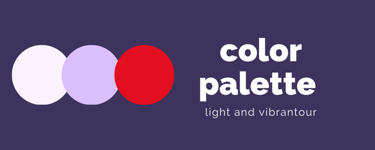
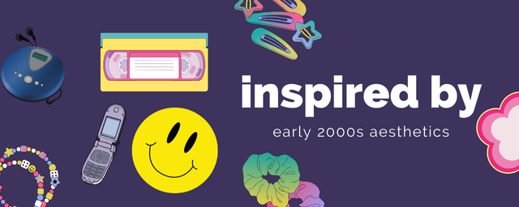
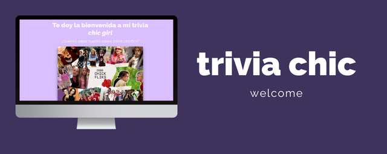
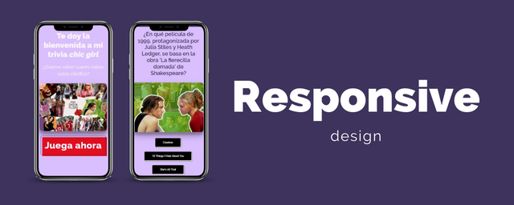

# Trivia Game - Single Page Application (SPA)

## Description

This is my first coding project, a trivia application where players can choose a topic and answer questions. It's built as a Single Page Application (SPA) to simplify the logic and navigation between different parts of the game without needing to reload the page.

### Main Features:
- **Topic selection:** Players can choose a trivia topic before starting the game.
- **Dynamic question handling:** Once a topic is chosen, questions are generated dynamically from an array of questions.
- **Game logic:** The game saves the player's answers as they progress. Players can go back to edit their answers before submitting.
- **Next question navigation:** Players can move to the next question, with each new question loading the appropriate content.
- **Shuffle answers:** Future plans include randomizing answer button positions for added challenge.

## How it works
1. **Topic Selection:** On the main page, the player selects a trivia topic.
2. **Question Display:** A function generates the question and answer elements dynamically.
3. **Answer Handling:** Each time the player selects an answer, it is stored, and the player can return to change it.
4. **Progression:** The game navigates to the next question, and the process repeats until all questions are answered.

## Design Style

The design of the project is **pop** and **chic**, inspired by early 2000s aesthetics to make the experience engaging and fun for players who love **chick flicks**. The color palette is light and vibrant, incorporating shades of pink and purple to emphasize the playful and stylish vibe.

Below is a preview of the main page design:




## Responsiveness

The trivia app is fully responsive, adjusting smoothly across different screen sizes, from mobile devices to desktop computers. Here’s an example demonstrating how the design adapts:

### Desktop:


### Mobile:


## Technologies Used
- JavaScript (for game logic and dynamic content generation)
- HTML/CSS (for layout and design)
- SPA architecture

## Installation
1. Clone the repository:
   ```bash
   git clone https://github.com/your-username/trivia-game.git

## Future Improvements
- Randomizing answer buttons.
- Adding a timer for each question.
- Improving mobile responsiveness.

